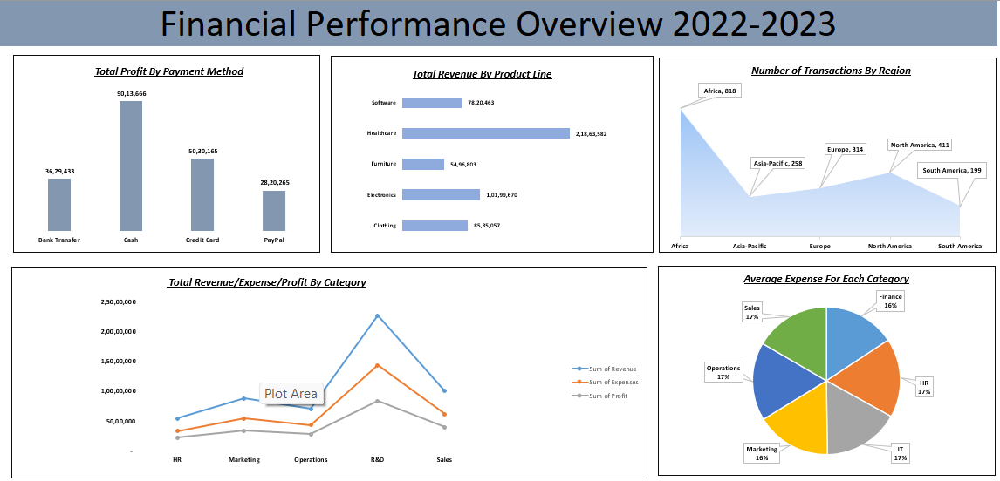

# Excel-fianancial-performance-dashboard

# Financial Performance Overview 2022-2023

An Excel dashboard that analyzes company revenue, expenses and profit across regions, product lines, departments and payment methods.

## Project Overview
This project turns raw transaction data into a one-page dashboard that helps answer key business questions about financial performance.

## Business Questions Answered
- Which payment method generates the most profit?
- Which product lines bring in the most revenue?
- Which regions have the most transactions?
- How do revenue, expenses and profit compare across categories?
- How are expenses distributed across departments?

## Key Insights
- **Africa** leads in number of transactions (818).
- **Healthcare** is the top product line by revenue (about 2.18 crore).
- **Cash** payments generate the highest total profit (about 90 lakh).
- **R&D** has the highest revenue, expenses and profit among categories.
- Average expenses are spread almost evenly across departments (16-17% each).

## Tools Used
- Microsoft Excel
- PivotTables and PivotCharts
- Data visualization (bar, area, line and pie charts)
